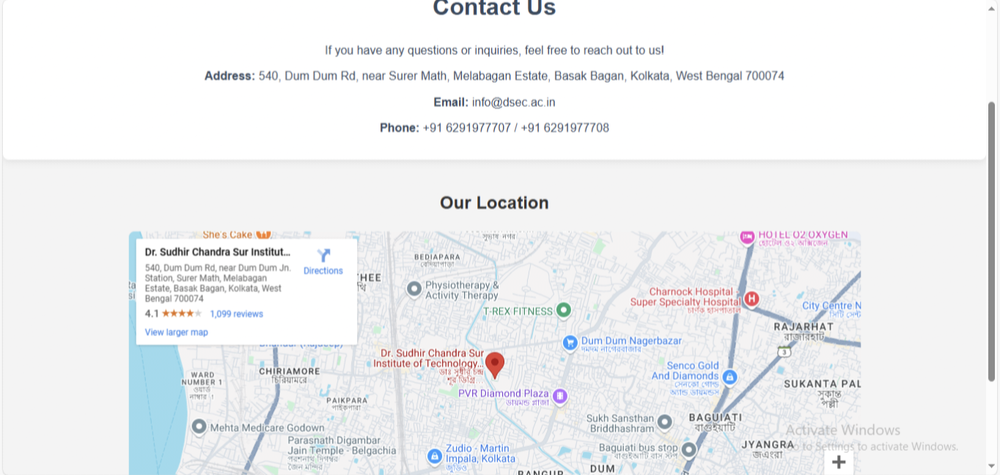

# Student Management System

Welcome to the **Student Management System** repository! This project is designed to simplify the management of students, teachers, and academic resources for educational institutions. It provides an intuitive interface for students and faculty to interact with various academic functionalities, including registration, class routines, announcements, and more.

## Features

- **Student Registration & Login:**
  - Students can easily create accounts, log in securely, and manage their information.
  
- **Teacher Management:**
  - Teachers can register, log in, and manage their profiles and academic data.

- **Class Routine:**
  - View detailed class schedules with timings and subjects, ensuring students and faculty can plan their time effectively.

- **Downloadable Resources:**
  - Access and download essential books and resources related to academic courses and subjects.

- **Real-time Announcements:**
  - Stay updated with important announcements such as deadlines, exams, and events.
  
- **Admin Dashboard:**
  - Admin users can manage student and teacher data, update course schedules, and monitor the system activity.

- **Responsive Design:**
  - Fully responsive and mobile-friendly UI to ensure accessibility across all devices.

## Screenshots





## Technologies Used

- **Frontend:**
  - HTML
  - CSS (with responsive design)
  - JavaScript (for interactive functionality)
  
- **Backend:**
  - Firebase Firestore (used for cloud-based database management)

- **Authentication:**
  - Firebase Authentication (for secure registration and login)

## Installation

To set up the project locally on your machine, follow these steps:

### Step 1: Clone the Repository

Clone the repository to your local machine using the following command:

```bash
git clone https://github.com/MrPopZzz/Student-Management-System.git
